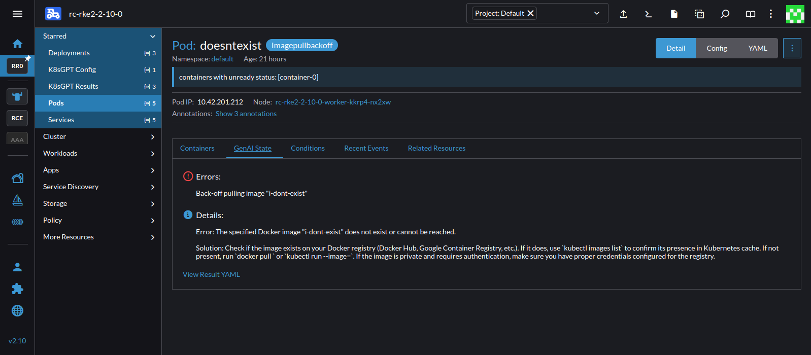

# Hack Week Notes

Project - https://hackweek.opensuse.org/24/projects/rancher-genai-ui-extension

Inspiration - https://www.suse.com/c/rancher_blog/debugging-your-rancher-kubernetes-cluster-the-genai-way-with-k8sgpt-ollama-rancher-desktop/


## Day 1

### Notes

- K8SGTP
  - Tool to scan cluster, diagnose and triage issues in simple english
  - https://github.com/k8sgpt-ai/k8sgpt
  - https://github.com/k8sgpt-ai/k8sgpt-operator
  - https://artifacthub.io/packages/helm/k8sgpt/k8sgpt-operator
- Ollama
  - https://ollama.com/
  - https://github.com/ollama/ollama
  - https://artifacthub.io/packages/helm/ollama-helm/ollama
  - LLM, mistral

### Run locally (host machine + cli)

1. Install K8SGPT cli - https://docs.k8sgpt.ai/getting-started/installation/
   - `curl -LO https://github.com/k8sgpt-ai/k8sgpt/releases/download/v0.3.24/k8sgpt_amd64.rpm`
   - `sudo rpm -ivh -i k8sgpt_amd64.rpm`
2. Install Ollama - https://ollama.com/download
   - `curl -fsSL https://ollama.com/install.sh | sh`
3. Launch Ollama
   - (done as part of install, but if running separately) `ollama serve`
4. Pull LLM
   - `ollama pull mistral`
5. Tell K8SGPT to use ollama backend
   - `k8sgpt auth add --backend localai --model mistral --baseurl http://localhost:11434/v1`
6. GOGOGO
   - `k8sgpt analyze --explain --backend localai --with-doc --kubeconfig ~/dev/hackweek/rc-rke2.yaml`

### Run all in cluster (kube cluster + operator)

1. Install K8SGPT operator
   - https://docs.k8sgpt.ai/getting-started/in-cluster-operator/
   - Add repo - https://charts.k8sgpt.ai/
   - Install chart - k8sgpt-operator (in ns k8sgpt-operator) (0.2.0)
2. Install Ollama
   - https://artifacthub.io/packages/helm/ollama-helm/ollama
   - Add repo - https://otwld.github.io/ollama-helm/
   - Install chart - ollama (in ns ollama) (o.4.1)
      - Make sure to update values.yaml ollama.models: [] to be ["mistral"]
3. Make note of Ollama service endpoint
   - ollama service in ollama ns
   - endpoint is target
4. Tell K8SGPT to use ollama backend. Apply following yaml
   - ```
      apiVersion: core.k8sgpt.ai/v1alpha1
      kind: K8sGPT
      metadata:
        name: k8sgpt-ollama
        namespace: k8sgpt-operator
      spec:
        ai:
          enabled: true
          model: mistral
          backend: localai
          baseUrl: http://10.43.16.242:11434/v1 # replace with ollama service endpoint
        noCache: false
        filters: ["Pod", "Service", "Event", "Node"]
        repository: ghcr.io/k8sgpt-ai/k8sgpt
        version: v0.3.41
     ```

### K8sGPT Results
- View k8sgpt operator controller-manager `pod` --> `manager` container log for worthwhile info
- View k8sgpt ollama `pod` log for details about the args used in k8sgtp analyse request
- View ollama `pod` log for http request (and path) logs
- If there are dodgy pods then there should be `core.k8sgpt.ai.result` / `Results` CR's created
  - Examples i was using
    - pod with container image all in caps
    - pod with container image that does not exist
    - pod that's broken https://raw.githubusercontent.com/robusta-dev/kubernetes-demos/main/crashpod/broken.yaml
    - service with a selector not applicable to any pods (after adding service type to k8sgpt config object)

### Troubleshooting

- There's no `detail` in a `core.k8sgpt.ai.result`
  - k8sgpt operator is probably silently failing to connect to ollama
  - nuke the `k8sgpt-operator-system/k8sgpt-operator-controller-manager-<sdf>` POD and check the start of it's container named `manager` 
  - the state of the connection between the operator and ollama should be announced there 

### UI Extension

- Create initial ui extension
  - Added better labelling for k8sgpt resource types
  - Added column in `core.k8sgpt.ai.result` table to link to target resource
  - Added new tab in pod resource detail page containing simple text of issue

## Day 2
- Beefed Up ui extension
  - Better tab formatting, display and content
  - Better l10n
  - Create a list override component for k8sgpt results table (better columns)
  - Bring back k8sgpt result resource model
  - Add tab and columns to service type
  - Switch from BadgeStateFormatter to custom extension formatter for resource genai column badge
- Resolved some extension issues around shell imports and build
  - In a ts, or vue component with script ts, cannot import ts based files that haven't had type generated and shipped in shell (type-gen)
  - shell/mixins/resource-fetch, @shell/plugins/steve/steve-class
- Experimented with different resource types
  - service
    - picked up selector with no hits
  - catalog.cattle.io.clusterrepo
    - CRDs don't have analyzers - https://github.com/k8sgpt-ai/k8sgpt?tab=readme-ov-file#built-in-analyzers
  - event
    - didn't create any results (would this contribute info to other resources?)
  - node
    - didn't create any results (would this contribute info to other resources?)

## Day 3
- Built 2.9 UI extension charts (lots of issues)
- Update ui extension to be 2.10 compatible (issues)
- Bring up v2.10.0 to text extension with and setup env again
  - v2.10.0 docker image doesn't seem healthy on my local box, keeps crashing. 
    - due to disk pressure on node (aka ~/). filelight to the rescue
    - also due to ollama...
  - brought up v2.10.0 in dev DO machine  

## Day 4
- Half day working on day job things...
- Add screenshots, tidy up, update project page, etc
- Creating dashboard issues....

## Screenshots

### Extension Management


### K8sGPT Results


#### Result YAML


### Pods View


#### Pod Detail View 1


#### Pod Detail View 2


### Services View


#### Service Detail View


## Takeaways
- K8SGTP / OLLAMA
  - There's pretty bad feedback on failure state from k8sgpt / operator.
    - failure to communicate with ollama resulting in no error messages, failing conditions, etc. had to dive into logs to see failure
    - create rancher/dashboard issue
      - For workloads with multiple contains make it clearer that the log view covers both and user can switch between them
        - https://github.com/rancher/dashboard/issues/12643
      - The log view can really struggle with streams that print out 2/3 every second. Should the default no be 30 minute but 10k lines?
        - https://github.com/rancher/dashboard/issues/12644
  - Limited set of resource analysers, no smarts for CRs
- Dashboard (to create issues)  
  - Docs
    - Improve the ui extension getting started guide - https://github.com/rancher/dashboard/issues/12649
      - https://extensions.rancher.io/extensions/next/extensions-getting-started
      - not an a --> b guide. introduced to a command at top, then random sidetrack on how to get a kube cluster up and running (doesn't need to be in guide), then arg info for command from above and different ways it can be used
    - Populate ts definitions for existing, documented types - https://github.com/rancher/dashboard/issues/12650
      - TableColumn
    - Add info to extension point tabs to inform user the resource is a prop in the component. https://extensions.rancher.io/extensions/next/api/tabs.
      - https://github.com/rancher/dashboard/issues/12651
    - Create types for additional js files (entries in type-gen, otherwise ts based files will fail to build) - https://github.com/rancher/dashboard/issues/12652
      - '@shell/mixins/resource-fetch'
      - '@shell/plugins/steve/steve-class'
    - No search in dev kit site
      - https://github.com/rancher/dashboard/issues/12653
    - publish guide - https://github.com/rancher/dashboard/issues/12654
      - Not clear gh-pages needs to be created (step by step) https://extensions.rancher.io/extensions/next/publishing#proper-tagged-release-naming-scheme-to-build-extension-catalog-image
      - Not clear how to add to rancher after chart created
  - Creating App
    - App Creator creates incorrect pkg annotations (> 3.0.0 but rancher > 2.9.3) - https://github.com/rancher/dashboard/issues/12635#issuecomment-2491509598
  - Core Dashboard
    - Review 'starred' grouping. on return, nav around, etc annoying to have to continually re-open starred group - https://github.com/rancher/dashboard/issues/12647
    - Resource search should search on native name as well as label (authconfig vs Auth Provider) - https://github.com/rancher/dashboard/issues/12648
    - Resource search should search on partial string `crd` would match CustomResourceDefinition - https://github.com/rancher/dashboard/issues/12648
  - Extension Functionality
    - Ability to specify order of column added to table - https://github.com/rancher/dashboard/issues/12646
    - `/dist-pkg` should be added to extension app's package.json - https://github.com/rancher/dashboard/issues/12645
  - Creating an extension for 2.9 is hard - https://github.com/rancher/dashboard/issues/12036
    - creator creates 3.x version
    - lots of manual copy and paste
    - build-extension-charts point to master, however changing to release-2.9 required additional tagged_release input `tagged_release: ${{ github.ref_name }}` to `jobs ... with`
  - Upgrade to vue3 - https://github.com/rancher/dashboard/issues/12656
    - Doc not a clear step by step guide
    - Doc is missing step to update to 20 <= local node <= 22 https://extensions.rancher.io/extensions/next/rancher-2.10-support#how-to-proceed-with-your-extension-update
    - migration script adds wrong annotation - https://github.com/rancher/dashboard/issues/12655
      - "catalog.cattle.io/ui-extension-version": ">= 3.0.0"
      - should be `ui-extensions-version`
    - Doc missing yarn install after migrate
    - Then got an error, resolved by removing some stale references in core package.json (matching elemental-ui root package.json), nuking node_modules and yarn install
      ```
      ✔  Building for production as library (umd-min)...
      ERROR  WebpackOptionsValidationError: Invalid configuration object. Webpack has been initialised using a configuration object that does not match the API schema.
              - configuration[0].module.rules[8].type should be one of these:
                "javascript/auto" | "javascript/dynamic" | "javascript/esm" | "json" | "webassembly/experimental"
                -> Module type to use for the module
      ```
    - Then got TS errors weren't getting before
      - due to ts component importing js component `component: { Loading }` --> `as any`
- When creating the extension here's some of the reasons i had to switch to look at 
dashboard code
  - what's passed through to tab component props
  - formatters library
  - how to get to store from column getValue
  - had to look at code of BadgeStateFormatter to work out solution (arbitrary), STATES_ENUM

## Next Steps
- The majority of time was spent on ui extension based activities. Next time i'd like to contribute more to actual k8sgtp output
  - Add additional k8sgpt analysers, maybe create some for rancher CRDs
    - https://github.com/k8sgpt-ai/k8sgpt?tab=readme-ov-file#proceed-with-care  `Custom Analyzers`
    - can this be configured with k8sgpt-operator?
  - Try a different LLM other than ollama?
  - Minor Config Improvements 
    - rename localai --> ollama
    - set anonymize false
- If time, to then move on to 
  - Improved UX
    - Notifications for new / changes results?  